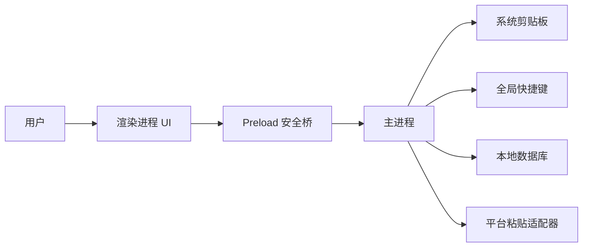
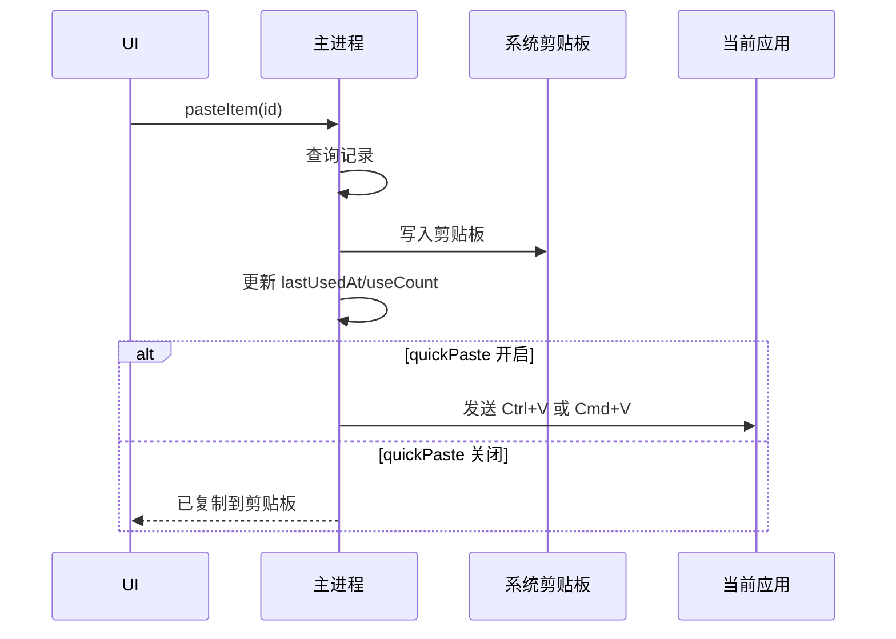

# 软件设计说明 SDD

## 1. 总览

本项目是一个桌面端剪贴板历史工具。应用常驻运行，默认展示悬浮球；用户点击悬浮球或使用快捷键后，显示历史面板。主进程负责系统级能力，渲染进程负责 UI，二者通过受控 IPC 通信。

首版推荐 Electron 架构，以便复用现有 HTML 原型并获得成熟的桌面能力。



## 2. 进程职责

### 2.1 主进程

负责所有系统级能力：

- 创建悬浮球窗口和历史面板窗口。
- 管理窗口位置、大小、置顶和显示状态。
- 监听剪贴板变化。
- 注册全局快捷键。
- 读写本地数据库。
- 执行快速粘贴的平台适配逻辑。
- 处理托盘、开机启动等后续桌面能力。

### 2.2 渲染进程

负责界面与交互：

- 展示悬浮球。
- 展示历史面板、搜索、列表、底部状态。
- 发起删除、清空、收藏、粘贴等用户操作。
- 接收主进程推送的历史更新。
- 保持视觉风格与 `剪贴板历史记录工具.html` 一致。

### 2.3 Preload 安全桥

只暴露明确允许的 API：

```ts
type ClipboardHistoryApi = {
  listItems(query?: string): Promise<ClipboardItem[]>;
  pasteItem(id: string): Promise<void>;
  copyItem(id: string): Promise<void>;
  deleteItem(id: string): Promise<void>;
  clearItems(): Promise<void>;
  togglePanel(): Promise<void>;
  updateSettings(settings: Partial<AppSettings>): Promise<AppSettings>;
  onItemsChanged(callback: (items: ClipboardItem[]) => void): () => void;
};
```

渲染进程不应直接访问 Node.js、文件系统或系统命令。

## 3. 窗口设计

首版可以使用一个透明无边框窗口，在 UI 内部切换悬浮球和面板状态；也可以拆成两个窗口。推荐首版使用单窗口，降低状态同步复杂度。

窗口要求：

- `alwaysOnTop: true`。
- `frame: false`。
- `transparent: true`。
- 悬浮球状态尺寸较小。
- 面板状态恢复上次位置和尺寸。
- 面板最小宽高限制，避免内容不可用。

## 4. 剪贴板监听设计

Electron 本身没有跨平台剪贴板变更事件，首版采用低频轮询：

- 默认间隔：500ms 到 1000ms。
- 应用暂停记录时停止轮询。
- 读取文本内容后计算哈希。
- 哈希与上一条相同则忽略。
- 空内容忽略。
- 超过最大长度的文本可截断预览，但原文是否保存由设置决定。

后续可针对不同系统替换为原生事件监听。

## 5. 数据模型

### 5.1 ClipboardItem

```ts
type ClipboardItemType = "text" | "link" | "image" | "file";

type ClipboardItem = {
  id: string;
  type: ClipboardItemType;
  title?: string;
  preview: string;
  contentText?: string;
  contentPath?: string;
  mimeType?: string;
  sizeBytes?: number;
  hash: string;
  isFavorite: boolean;
  sourceApp?: string;
  createdAt: string;
  updatedAt: string;
  lastUsedAt?: string;
  useCount: number;
};
```

### 5.2 AppSettings

```ts
type AppSettings = {
  maxItems: number;
  autoDeleteDays?: number;
  recordText: boolean;
  recordLinks: boolean;
  recordImages: boolean;
  recordFiles: boolean;
  pauseRecording: boolean;
  quickPaste: boolean;
  openPanelHotkey: string;
  pasteLatestHotkey?: string;
  ignoreApps: string[];
  windowBounds?: {
    x: number;
    y: number;
    width: number;
    height: number;
  };
};
```

## 6. 本地存储

推荐使用 SQLite：

- 适合历史记录查询、删除、迁移。
- 支持按时间、收藏、类型、哈希索引。
- 便于后续扩展图片和文件元数据。

MVP 表结构：

```sql
CREATE TABLE clipboard_items (
  id TEXT PRIMARY KEY,
  type TEXT NOT NULL,
  title TEXT,
  preview TEXT NOT NULL,
  content_text TEXT,
  content_path TEXT,
  mime_type TEXT,
  size_bytes INTEGER,
  hash TEXT NOT NULL,
  is_favorite INTEGER NOT NULL DEFAULT 0,
  source_app TEXT,
  created_at TEXT NOT NULL,
  updated_at TEXT NOT NULL,
  last_used_at TEXT,
  use_count INTEGER NOT NULL DEFAULT 0
);

CREATE INDEX idx_clipboard_items_created_at
ON clipboard_items(created_at DESC);

CREATE UNIQUE INDEX idx_clipboard_items_hash_type
ON clipboard_items(hash, type);
```

设置可保存为 JSON 文件，也可保存到 SQLite `settings` 表。首版建议 JSON，便于人工排查。

## 7. 快速粘贴流程

点击记录后的流程：



平台差异：

- Windows：发送 `Ctrl+V`。
- macOS：发送 `Cmd+V`。
- Linux：发送 `Ctrl+V`，但不同桌面环境可能需要适配。

快速粘贴应放在平台适配层，方便替换底层实现。

## 8. UI 设计继承

从现有原型继承：

- 毛玻璃背景：半透明白色、模糊、轻边框。
- 入口：右下角圆形悬浮球。
- 面板：右下展开，圆角，带动画。
- 顶部：搜索、固定、关闭。
- 列表项：类型、时间、内容预览、悬浮操作按钮。
- 底部：设置、记录数量、清空。

实现时建议把 UI 拆成组件：

- `FloatingBall`
- `HistoryPanel`
- `HistoryHeader`
- `HistoryList`
- `HistoryItem`
- `HistoryFooter`
- `SettingsPanel`

## 9. IPC 设计

建议通道：

| 通道 | 方向 | 说明 |
| --- | --- | --- |
| `history:list` | renderer -> main | 查询历史 |
| `history:changed` | main -> renderer | 推送历史变化 |
| `history:delete` | renderer -> main | 删除单条 |
| `history:clear` | renderer -> main | 清空历史 |
| `history:copy` | renderer -> main | 写回剪贴板 |
| `history:paste` | renderer -> main | 写回并触发粘贴 |
| `settings:get` | renderer -> main | 读取设置 |
| `settings:update` | renderer -> main | 更新设置 |
| `window:set-mode` | renderer -> main | 悬浮球/面板模式切换 |

所有 IPC 参数都需要校验，避免渲染进程传入任意路径或任意命令。

## 10. 错误处理

- 剪贴板读取失败：记录日志并跳过本轮。
- 数据库写入失败：UI 显示轻量错误状态，保留内存中的最近记录。
- 快速粘贴失败：退化为仅复制到剪贴板。
- 快捷键注册失败：设置页提示冲突并要求用户更换。
- 数据库迁移失败：备份旧数据库后停止迁移，避免破坏数据。

## 11. 测试策略

MVP 需要覆盖：

- 哈希去重。
- 文本和链接类型识别。
- 最大记录数清理。
- 删除和清空。
- 设置读写。
- IPC 参数校验。
- UI 列表过滤。

桌面端集成测试可后置，但发布前应人工验证：

- 悬浮球展开/关闭。
- 面板拖拽/缩放。
- 全局快捷键。
- 复制记录和快速粘贴。
- 重启后数据恢复。

## 12. 版本演进

- V0.1：文本历史 MVP。
- V0.2：搜索、收藏、设置面板、快捷键配置。
- V0.3：图片和文件记录。
- V0.4：忽略应用、自动过期、敏感内容保护。
- V1.0：安装包、开机启动、稳定迁移、完整错误提示。

