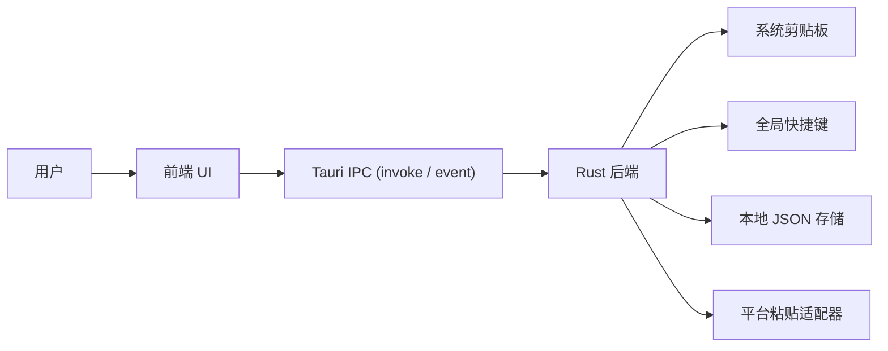
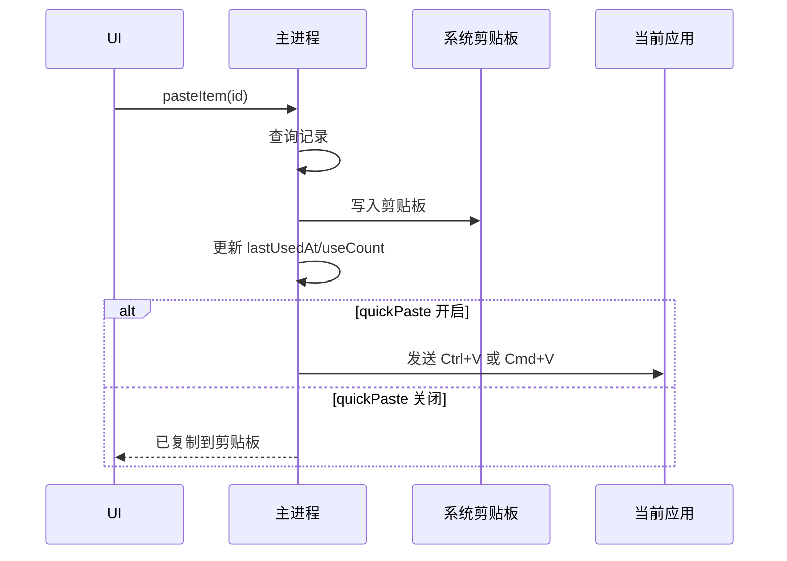

# 软件设计说明 SDD

## 1. 总览

本项目是一个桌面端剪贴板历史工具。应用常驻运行，默认展示悬浮球；用户点击悬浮球或使用快捷键后，显示历史面板。主进程负责系统级能力，渲染进程负责 UI，二者通过受控 IPC 通信。

项目已完成基于 Electron 的 v0.1 原型验证。当前架构迁移至 Tauri，以 Rust 后端驱动系统能力，前端 HTML/CSS/JS 100% 复用。工程策略继续以轻量化为先：不引入前端框架、原生数据库或重型打包器，优先完成稳定可用的 Windows 便携版 exe。



## 2. 进程职责

### 2.1 Rust 后端

负责所有系统级能力：

- 创建悬浮球窗口和历史面板窗口。
- 管理窗口位置、大小、置顶和显示状态。
- 监听剪贴板变化（低频轮询）。
- 注册全局快捷键。
- 读写本地历史和设置文件。
- 执行快速粘贴的平台适配逻辑。
- 处理托盘、开机启动等后续桌面能力。

### 2.2 渲染进程

负责界面与交互：

- 展示悬浮球。
- 展示历史面板、搜索、列表、底部状态。
- 发起删除、清空、收藏、粘贴等用户操作。
- 接收主进程推送的历史更新。
- 保持视觉风格与 `剪贴板历史记录工具.html` 一致。

### 2.3 Tauri IPC 通信

前端通过 Tauri 的 `invoke` 调用 Rust 后端命令，通过 `listen` 接收后端事件：

```ts
// 前端调用示例
import { invoke } from '@tauri-apps/api/tauri';
import { listen } from '@tauri-apps/api/event';

invoke('list_items', { query?: string }): Promise<ClipboardItem[]>;
invoke('paste_item', { id: string }): Promise<void>;
invoke('delete_item', { id: string }): Promise<void>;
invoke('clear_items'): Promise<void>;
invoke('update_settings', { settings: Partial<AppSettings> }): Promise<AppSettings>;

listen('history:changed', (event) => { ... });
```

前端不应直接访问文件系统或执行系统命令，所有系统交互必须通过 Rust 命令完成。

## 3. 窗口设计

使用一个透明无边框窗口，在 UI 内部切换悬浮球和面板状态。单窗口方案降低状态同步复杂度。

窗口要求：

- `always_on_top: true`（Tauri `WindowBuilder`）。
- `decorations: false`。
- `transparent: true`。
- 悬浮球状态尺寸较小。
- 面板状态恢复上次位置和尺寸。
- 面板最小宽高限制，避免内容不可用。
- 拖拽区域使用 `data-tauri-drag-region` 属性标记。

## 4. 模块拆分

在保持轻量的前提下，Rust 后端按能力拆分：

```text
src-tauri/src/
├─ main.rs           # 应用入口、Tauri 命令注册
├─ window.rs         # 窗口管理、模式切换、置顶
├─ clipboard.rs      # 剪贴板轮询、哈希、类型识别
├─ history_store.rs  # JSON 历史存储
├─ settings_store.rs # JSON 设置存储
└─ paste_adapter.rs  # 快速粘贴平台适配
```

前端暂时保留原生 HTML/CSS/JS。当 UI 复杂度明显增加后，再评估是否引入组件化方案。

## 5. 剪贴板监听设计

Tauri 本身没有跨平台剪贴板变更事件，首版采用低频轮询：

- 默认间隔：800ms。
- 应用暂停记录时停止轮询。
- 读取文本内容后计算哈希。
- 哈希与上一条相同则忽略。
- 空内容忽略。
- 超过最大长度的文本可截断预览，但原文是否保存由设置决定。
- 默认只记录文本和链接。

后续可针对不同系统替换为原生事件监听。

## 6. 数据模型

### 6.1 ClipboardItem

```ts
type ClipboardItemType = "text" | "link" | "image" | "file";

type ClipboardItem = {
  id: string;
  type: ClipboardItemType;
  title?: string;
  preview: string;
  contentText?: string;
  contentPath?: string;
  mimeType?: string;
  sizeBytes?: number;
  hash: string;
  isFavorite: boolean;
  sourceApp?: string;
  createdAt: string;
  updatedAt: string;
  lastUsedAt?: string;
  useCount: number;
};
```

### 6.2 AppSettings

```ts
type AppSettings = {
  maxItems: number;
  pollIntervalMs: number;
  maxTextLength: number;
  previewLength: number;
  autoDeleteDays?: number;
  recordText: boolean;
  recordLinks: boolean;
  recordImages: boolean;
  recordFiles: boolean;
  pauseRecording: boolean;
  quickPaste: boolean;
  openPanelHotkey: string;
  pasteLatestHotkey?: string;
  ignoreApps: string[];
  windowBounds?: {
    x: number;
    y: number;
    width: number;
    height: number;
  };
};
```

## 7. 本地存储

MVP 使用 JSON 文件而不是 SQLite：

- 无原生依赖，便携版 exe 更容易稳定产出。
- 文件可人工排查，早期调试成本低。
- 记录数量默认较小，内存过滤足够可用。

存储位置使用 Tauri `app_data_dir()`：

```text
<app_data_dir>/
├─ history.json
├─ settings.json
└─ logs/
```

写入策略：

- 读取失败时返回空历史并记录错误。
- 写入时先写临时文件，再重命名为正式文件。
- 每次新增记录后按 `maxItems` 裁剪非收藏记录。
- 默认 `maxItems` 为 100。
- 默认 `maxTextLength` 为 20000，避免极端大文本拖慢常驻进程。

当历史规模、查询复杂度或多类型内容存储超过 JSON 能力时，再升级为 SQLite，并提供一次性迁移脚本。

## 8. 快速粘贴流程

点击记录后的流程：



平台差异：

- Windows：发送 `Ctrl+V`。
- macOS：发送 `Cmd+V`。
- Linux：发送 `Ctrl+V`，但不同桌面环境可能需要适配。

快速粘贴应放在平台适配层，方便替换底层实现。

## 9. UI 设计继承

从现有原型继承：

- 毛玻璃背景：半透明白色、模糊、轻边框。
- 入口：右下角圆形悬浮球。
- 面板：右下展开，圆角，带动画。
- 顶部：搜索、固定、关闭。
- 列表项：类型、时间、内容预览、悬浮操作按钮。
- 底部：设置、记录数量、清空。

实现时建议把 UI 拆成组件：

- `FloatingBall`
- `HistoryPanel`
- `HistoryHeader`
- `HistoryList`
- `HistoryItem`
- `HistoryFooter`
- `SettingsPanel`

## 10. IPC 设计

建议通道：

| 通道 | 方向 | 说明 |
| --- | --- | --- |
| `history:list` | renderer -> main | 查询历史 |
| `history:changed` | main -> renderer | 推送历史变化 |
| `history:delete` | renderer -> main | 删除单条 |
| `history:clear` | renderer -> main | 清空历史 |
| `history:copy` | renderer -> main | 写回剪贴板 |
| `history:paste` | renderer -> main | 写回并触发粘贴 |
| `settings:get` | renderer -> main | 读取设置 |
| `settings:update` | renderer -> main | 更新设置 |
| `window:set-mode` | renderer -> main | 悬浮球/面板模式切换 |

所有 IPC 参数都需要校验，避免渲染进程传入任意路径或任意命令。

## 11. 打包设计

早期发布以 Windows 便携版 exe 为主：

```text
src-tauri/target/release/ClipBall.exe
```

使用 `tauri build` 内置打包，无需自定义脚本。Tauri 同时原生支持 MSI 和 NSIS 安装包：

```text
src-tauri/target/release/bundle/msi/ClipBall_<version>_x64_en-US.msi
src-tauri/target/release/bundle/nsis/ClipBall_<version>_x64-setup.exe
```

- v0.x 优先便携版 `ClipBall.exe`，适合快速迭代和手动分发。
- 需要桌面快捷方式、卸载入口、开机启动时直接使用 Tauri 产出的 MSI 或 NSIS 安装包，无需额外工具链。
- v1.0 评估启用 Tauri 内置自动更新插件。

## 12. 错误处理

- 剪贴板读取失败：记录日志并跳过本轮。
- JSON 写入失败：UI 显示轻量错误状态，保留内存中的最近记录。
- 快速粘贴失败：退化为仅复制到剪贴板。
- 快捷键注册失败：设置页提示冲突并要求用户更换。
- 存储迁移失败：备份旧数据后停止迁移，避免破坏用户历史。

## 13. 测试策略

MVP 需要覆盖：

- 哈希去重。
- 文本和链接类型识别。
- 最大记录数清理。
- 删除和清空。
- 设置读写。
- IPC 参数校验。
- UI 列表过滤。
- Windows 便携版 exe 启动。

桌面端集成测试可后置，但发布前应人工验证：

- 悬浮球展开/关闭。
- 面板拖拽/缩放。
- 全局快捷键。
- 复制记录和快速粘贴。
- 重启后数据恢复。

## 14. 版本演进

- V0.1：Electron 原型验证（悬浮球、历史面板、便携版 exe）—— 已完成。
- V0.2：Tauri 工程初始化、窗口移植、文本和链接监听、JSON 持久化、真实历史列表。
- V0.3：搜索、删除、清空、点击复制。
- V0.4：快捷键打开面板、快速粘贴和失败降级。
- V0.5：设置面板、暂停记录、最大记录数。
- V1.0：图标、托盘、日志、开机启动、自动更新、安装包。
